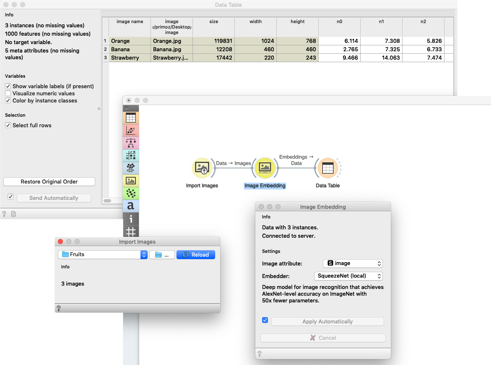

Image Embedding
================

Image embedding through deep neural networks.

**Inputs**

- Images: List of images.

**Outputs**

- Embeddings: Images represented with a vector of numbers.
- Skipped Images: List of images where embeddings were not calculated.

**Image Embedding** reads images and uploads them to a remote server or evaluate them locally. Deep learning models are used to calculate a feature vector for each image. It returns an enhanced data table with additional columns (image descriptors).

Images can be imported with [Import Images](importimages.md) widget or as paths to images in a spreadsheet. In this case the column with images paths needs a three-row header with *type=image* label in the third row.

Image Embedding offers several embedders, each trained for a specific task. Images are sent to a server or they are evaluated locally on the user's computer, where vectors representations are computed. SqueezeNet embedder offers a fast evaluation on users computer which does not require an internet connection. If you decide to use other embedders than SqueezeNet, you will need an internet connection. Images sent to the server are not stored anywhere.

1. Information on the number of embedded images and images skipped.
2. Settings:
   - *Image attribute*: attribute containing images you wish to embed
   - *Embedder*:

      - SqueezeNet: [Small and fast](https://arxiv.org/abs/1602.07360) model for image recognition trained on ImageNet.
      - Inception v3: [Google's Inception v3](https://arxiv.org/abs/1512.00567) model trained on ImageNet.
      - VGG-16: [16-layer image recognition model](https://arxiv.org/abs/1409.1556) trained on ImageNet.
      - VGG-19: [19-layer image recognition model](https://arxiv.org/abs/1409.1556) trained on ImageNet.
      - Painters: A model trained to [predict painters from artwork images](http://blog.kaggle.com/2016/11/17/painter-by-numbers-competition-1st-place-winners-interview-nejc-ilenic/).
      - DeepLoc: A model trained to analyze [yeast cell images](https://www.ncbi.nlm.nih.gov/pubmed/29036616).

3. Tick the box on the left to start the embedding automatically. Alternatively, click *Apply*. To cancel the embedding, click *Cancel*.
4. Access help.

Embedders
---------

**InceptionV3** is Google’s deep neural network for image recognition. It is trained on the ImageNet data set. The model we are using is available [here](http://download.tensorflow.org/models/image/imagenet/inception-2015-12-05.tgz). For the embedding, we use the activations of the penultimate layer of the model, which represents images with vectors. 

**SqueezeNet** is a deep model for image recognition that achieves AlexNet-level accuracy on ImageNet with 50x fewer parameters. The model is trained on the ImageNet dataset. We re-implemented the SqueezeNet by using weights from the [author’s pretrained model](https://github.com/DeepScale/SqueezeNet). We use activations from pre-softmax (`flatten10`) layer as an embedding.

**VGG16** and **VGG19** are deep neural networks for image recognition proposed by Visual Geometry Group from the University of Oxford. They are trained on the ImageNet data set. We use a [community implementation](https://github.com/machrisaa/tensorflow-vgg) of networks with original weights. As an embedding, we use activations of the penultimate layer - `fc7`.

Image Embedding also includes [**Painters**](https://github.com/inejc/painters), an embedder that was trained on 79,433 images of paintings by 1,584 painters and won Kaggle’s Painter by Numbers competition. Activations of the penultimate layer of the network are used as an embedding.

**DeepLoc** is a convolutional network trained on 21,882 images of single cells that were manually assigned to one of 15 localization compartments. We use the pre-trained network proposed by [authors](https://github.com/okraus/DeepLoc). The embeddings are activations of penultimate layer `fc_2`. 

An [article](https://www.nature.com/articles/s41467-019-12397-x) by Godec et al. (2019) explains how the embeddings work and how to use it in Orange.

Example
-------

Let us first import images from a folder with [Import Images](importimages.md). We have three images of an orange, a banana and a strawberry in a folder called Fruits. From **Import Images** we will send a data table containing a column with image paths to **Image Embedding**.

We will use the default embedder *SqueezeNet*. The widget will automatically start retrieving image vectors from the server.

Once the computation is done, you can observe the enhanced data in a **Data Table**. With the retrieved embeddings, you can continue with any machine learning method Orange offers. Below is an example for clustering.

