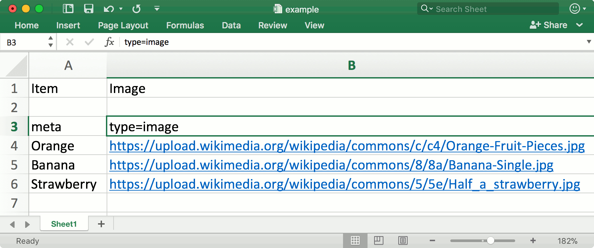
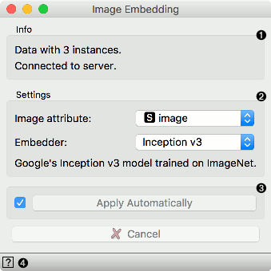
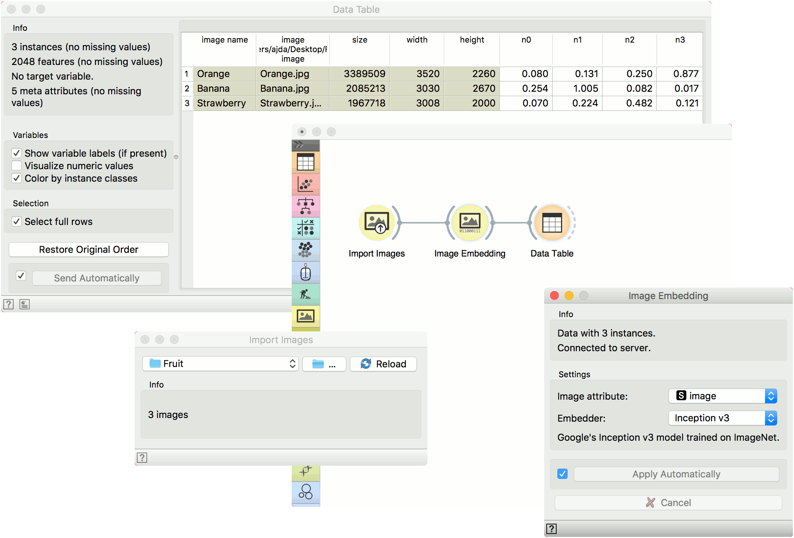
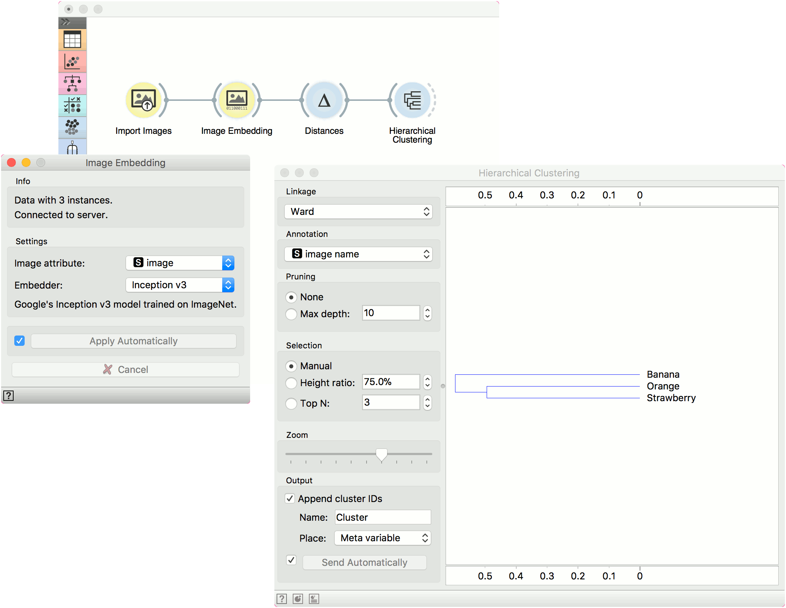

Image Embedding
================

.. figure:: icons/image-embedding.png

Image embedding through deep neural networks.

Signals
-------

**Inputs**:

-  **Images**

   List of images.

**Outputs**:

-  **Embeddings**

   Images represented with a vector of numbers.

-  **Skipped Images**

   List of images where embeddings were not calculated.

Description
-----------

**Image Embedding** reads images and uploads them to a remote server or evaluate them locally.
Deep learning models are used to calculate a feature vector for each image.
It returns an enhanced data table with additional columns (image descriptors).

Images can be imported with :doc:`Import Images <importimages>` widget or as paths to images in a spreadsheet.
In this case the column with images paths needs a three-row header with *type=image* label in the third row.

Image Embedding offers several embedders, each trained for a specific task.
Images are sent to a server or they are evaluated locally on the user's computer, where vectors representations are computed.
SqueezeNet embedder offers a fast evaluation on users computer which does not require an internet connection.
If you decide to use other embedders than SqueezeNet, you will need an internet connection.
Images sent to the server are not stored anywhere.

1. Information on the number of embedded images and images skipped.
2. Settings:

   - *Image attribute*: attribute containing images you wish to embed
   - *Embedder*:

       - SqueezeNet: `Small and fast <https://arxiv.org/abs/1602.07360>`_ model for image recognition trained on ImageNet.
       - Inception v3: `Google's Inception v3 <https://arxiv.org/abs/1512.00567>`_  model trained on ImageNet.
       - VGG-16: `16-layer image recognition model <https://arxiv.org/abs/1409.1556>`_ trained on ImageNet.
       - VGG-19: `19-layer image recognition model <https://arxiv.org/abs/1409.1556>`_ trained on ImageNet.
       - Painters: A model trained to `predict painters from artwork images <http://blog.kaggle.com/2016/11/17/painter-by-numbers-competition-1st-place-winners-interview-nejc-ilenic/>`_.
       - DeepLoc: A model trained to analyze `yeast cell images <https://www.ncbi.nlm.nih.gov/pubmed/29036616>`_.
3. Tick the box on the left to start the embedding automatically. Alternatively, click *Apply*. To cancel the embedding, click *Cancel*.
4. Access help.

Example
-------

Let us first import images from a folder with :doc:`Import Images <importimages>`.
We have three images of an orange, a banana and a strawberry in a folder called Fruits.
From **Import Images** we will send a data table containing a column with image paths
to **Image Embedding**.

We will use the default embedder *SqueezeNet*.
The widget will automatically start retrieving image vectors from the server.

Once the computation is done, you can observe the enhanced data in a **Data Table**.
With the retrived embeddings, you can continue with any machine learning method Orange offers. Below is an example for clustering.

