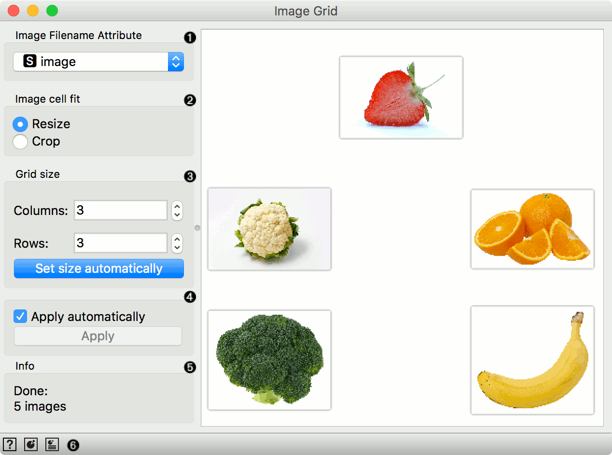
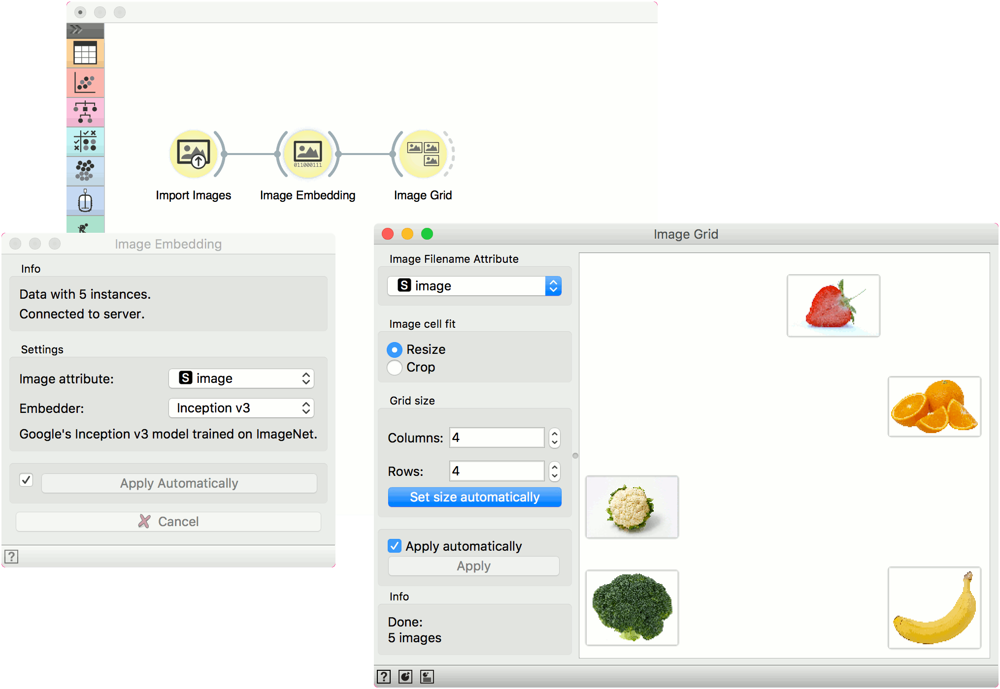

Image Grid
==========

.. figure:: icons/ImageGrid.png

Displays images in a similarity grid.

Signals
-------

**Inputs**:

-  **Embeddings**

   Image embeddings from Image Embedding widget.

-  **Data Subset**

   A subset of embeddings or images.

**Outputs**:

-  **Images**

   Images from the dataset.

Description
-----------

The **Image Grid** widget can display images from a dataset in a similarity grid - images with similar content are placed closer to each other. It can be used for image comparison, while looking for similarities or discrepancies between selected data instances (e.g. bacterial growth or bitmap representations of handwriting).

1. *Image Filename Attribute*: Attribute containing paths to images.
2. *Image cell fit*: Resize scales the images to grid, while Crop crops them to squares.
3. *Grid size*: Set the size of the grid. Click *Set size automatically* to optimize the projection.
4. Tick the box to commit the changes automatically. Alternatively, click *Apply*.
5. Information on the input.
6. Access help, save image, and report (in that order).

Example
-------

**Image Grid** can be used to visualize similarity of images in a 2D projection. We have used 5 images of fruits and vegetables, namely orange, banana, strawberry, broccoli and cauliflower.

We loaded the images with :doc:`Import Images <importimages>` and embedded them with Inception v3 embedder in :doc:`Image Embedding <imageembedding>`.

Finally, we visualized the images in **Image Grid**. It is obvious that broccoli and cauliflower and much more alike than strawberry and banana.

