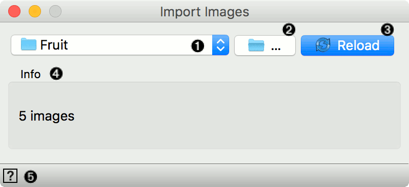
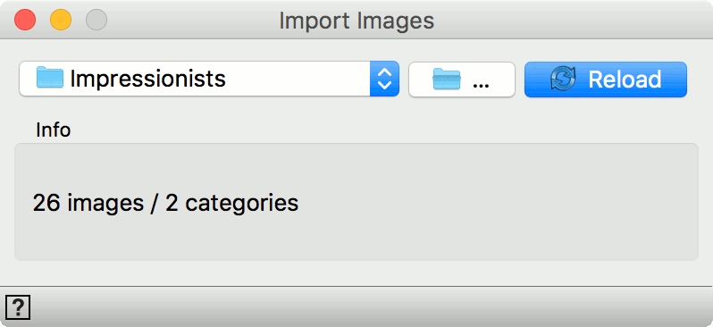
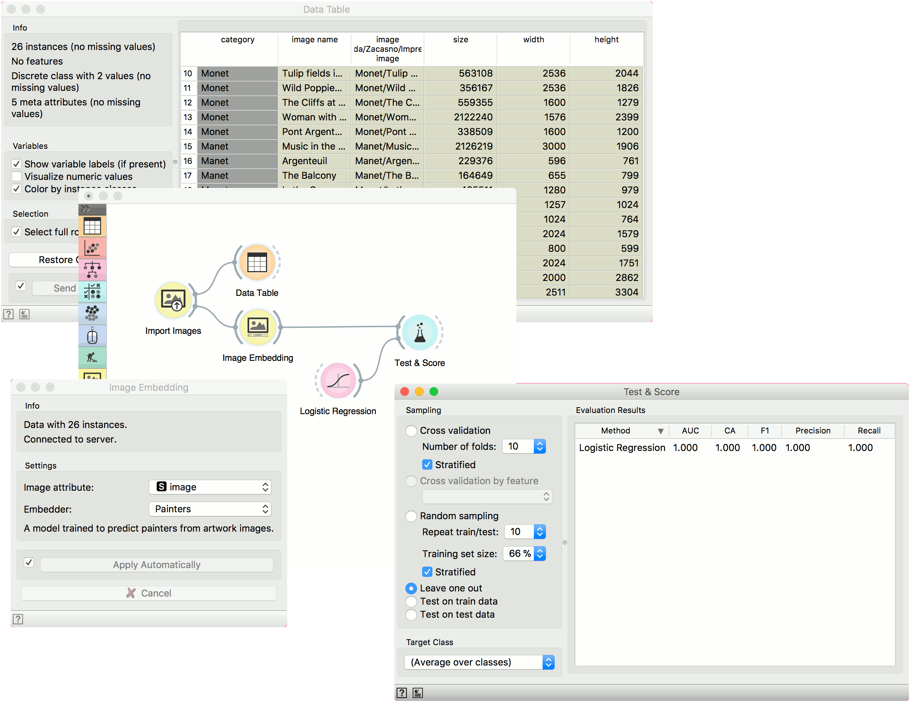

Import Images
=============

.. figure:: icons/ImportImages.png

Import images from a directory(s)

Signals
-------

**Inputs**:

-  (None)

**Outputs**:

-  **Data**

   Dataset describing one image in each row.

Description
-----------

**Import Images** walks through a directory and returs one row per 
located image. Columns include image name, path to image, width, height 
and image size. Column with image path is later used as an attribute for image visualization and embedding.

1. Currently loaded folder.
2. Select the folder to load.
3. Click *Reload* to update imported images.
4. Information on the input.
5. Access help.

You can load a folder containing subfolders. In this case Orange will consider each folder as a class value. In the example above, **Import Images** loaded 26 images belonging to two categories. These two categories will be used as class values.

Example
-------

**Import Images** is likely the first widget you will use in image analysis. It loads images and creates class values from folders. In this example we used **Import Images** to load 26 painting belonging to either Monet or Manet.

We can observe the result in a **Data Table**. See how Orange added an extra class attribute with values Monet and Manet?

Now we can proceed with standard machine learning methods. We will send images to :doc:`Image Embedding <imageembedding>`, where we will use *Painters* embedder to retrieve image vectors.

Then we will use **Test & Score** and **Logistic Regression**, to build a model for predicting the author of a painting. We get a perfect score? How come? It turns out, these were the images the *Painters* embedder was trained on, so a high accuracy is expected.

