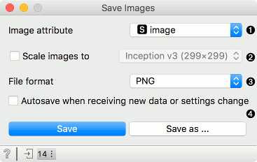
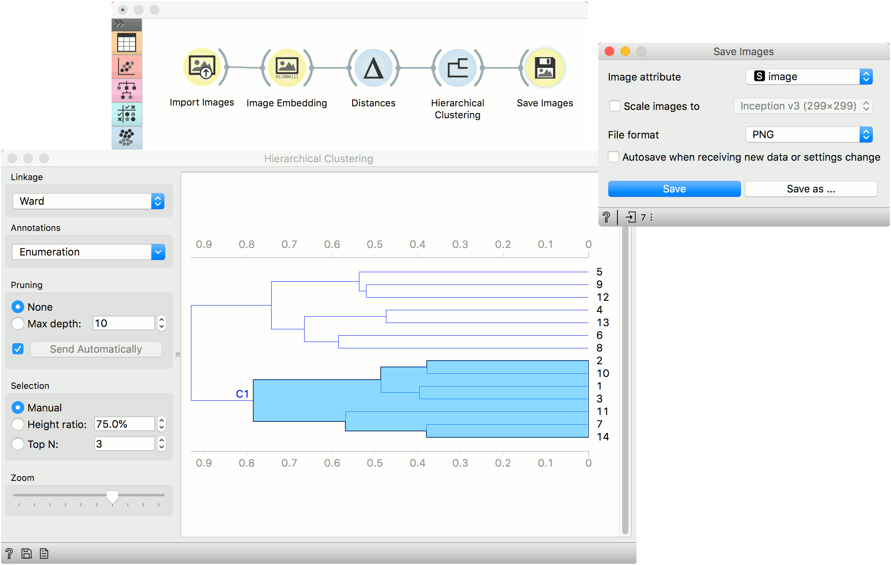

Save Images
===========

Save images in the directory structure.

**Inputs**

- Data: images to save.

**Save Images** is a simple widget that saves images sent to its input. Images will be saved as separate files in their own directory. When a class is present in the data, images will be saved in subdirectories based on the class variable.

1. Attribute containing the path to the image.
2. If *Scale images to* is ticked, images will be resized to the size used in the selected embedder:
   - Inception v3: 299x299
   - SqueezeNet: 227x227
   - VGG-16: 224x224
   - VGG-19: 224x224
   - Painters: 256x256
   - DeepLoc: 64x64
   - openface: 256x256
3. File format to save images in. See the next section for information on supported formats.
4. If *Autosave when receiving new data or settings change* is on, images will be saved upon every change. *Save* will save images, while *Save as...* enables the user to set the name and the folder where to save the images.

Supported Formats
-----------------

**Save Images** can save images in the following formats:

- .png
- .jpeg
- .gif
- .tiff
- .pdf
- .bmp
- .eps
- .ico

Example
-------

Here is a simple example how to use **Save Images**. We loaded 14 paintings from Picasso, sent them to [Image Embedding](imageembedding.md) using *Painters* embedder, then to [Distances](https://orange-visual-programming.readthedocs.io/widgets/unsupervised/distances.html) using cosine distance and finally to [Hierarchical Clustering](https://orange-visual-programming.readthedocs.io/widgets/unsupervised/hierarchicalclustering.html) to construct a dendrogram. Then we selected a cluster from the plot and saved the images belonging to the selected cluster with **Save Images**.

